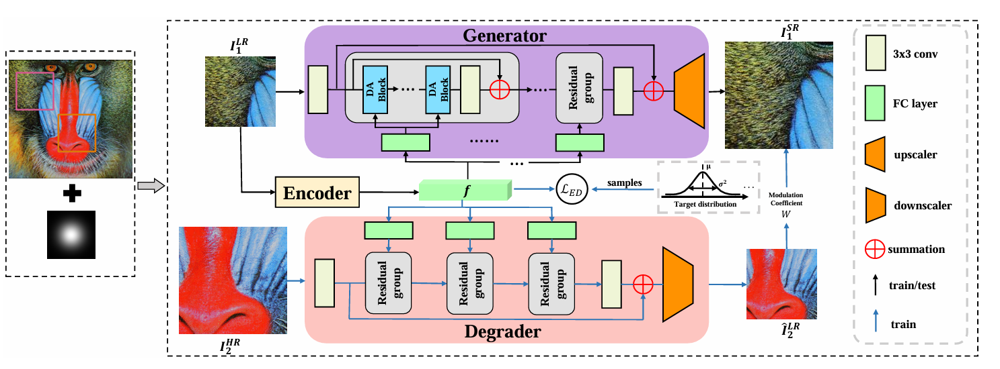

# Preserving Full Degradation Details for Blind Image Super-Resolution

Pytorch implementation of paper *Preserving Full Degradation Details for Blind Image Super-Resolution*.




## Installation

- Install python 3.8.0, torch 2.0.0, CUDA 11.7 and other essential packages (Note that using other versions of packages may affect performance).
- Clone this repo

```
git clone https://github.com/Chernobyllight/ReDSR
cd ReDSR
```


## Test

test setting1: model trained only on isotropic Gaussian blur kernels

test setting2: model trained on anisotropic Gaussian blur kernels and additive Gaussian noise

- Get into evaluation codes folder './TEST/TEST_setting1'

  ```
  cd ./TEST/TEST_setting1
  ```

- We provide pretrained models in './checkpoints/'. Before testing, specify the model checkpoint in 'test.yml'.

  ```
  DANET_CHECKPOINT: './checkpoints/setting1/setting1_ckp.tar'
  ```

   Or change the path with your own absolute path

- Run 'test.py'

  ```
  python test.py
  ```

## Train

- Get into training codes folder './TRAIN/TRAIN_setting1'

  ```
  cd ./TRAIN/TRAIN_setting1
  ```

- Specify the dataset path in 'train.yml'

  ```
  data:
  	clean_dir: './datasets/div2k'
  ```

  Or change the path with your own dataset absolute path

- Run 'train.py'

  ```
  python train.py
  ```

  